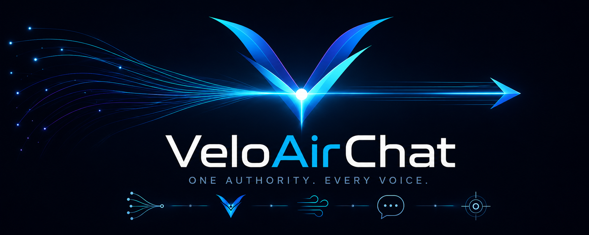

<p align="center">
  
</p>

# VeloAirChat

VeloAirChat is an independently developed, Velocity-centered chat system for
Minecraft proxy networks.

VeloAirChat began as a fork of HuskChat by William278. Since then, it has
developed its own central architecture, backend protocol, identity model and
rendering pipeline under the AirGalaxie/VeloAirChat identity. HuskChat remains
the origin of the project, but VeloAirChat is maintained and released as an
independent project.

## Current release

```text
VeloAirChat 1.0.0-beta.1
Protocol: v4
Minecraft: 26.2
```

The Git short hash and UTC build date are generated during the build and
stored in every JAR manifest as `VeloAirChat-Git` and `VeloAirChat-Built`.
Builds from source archives without Git metadata use `unknown` as the Git
value. `BUILD_DATE` or `SOURCE_DATE_EPOCH` can be supplied for reproducible
build-date metadata.

This is the first public beta. Proxy and backend artifacts using Protocol v3
and v4 cannot be mixed; update Velocity and every Paper or Fabric bridge
together.

## Architecture

Velocity is the central authority for identity, trust, permissions, channels,
routing, formatting, recipients and final rendering. Paper and Fabric capture
backend chat observations, exchange platform-neutral messages through Protocol
v4 and deliver the final Velocity-rendered output.

The architecture includes:

* `ChatEnvelope` as the backend-to-proxy chat transport
* `ChatIdentityContext` for Velocity-side Java, Floodgate and Geyser identity
  resolution
* `ChatContext` as the shared input for Minecraft and Dynmap rendering
* one central rendering pipeline for channel chat and integrations
* Paper and Fabric backend bridges
* signed-chat evidence capture and centralized trust policy
* optional Floodgate and Geyser identity providers
* optional Dynmap publishing of the final rendered message

## Features

* Velocity-centered proxy runtime
* LuckPerms prefix, suffix and group metadata support
* Optional MiniPlaceholders integration
* Optional PlaceholderAPI backend bridges for Paper/Spigot and Fabric expansions
* Optional Dynmap webchat publishing from the final Velocity-rendered bridge message
* MiniMessage formatting with legacy format compatibility
* Network channels, local/global scopes and passthrough modes
* Private messages, replies and group messages
* Social spy, local spy, broadcasts, filters and replacers

## Building

Requirements:

* JDK 25
* No system Gradle installation is required; use the included Gradle wrapper

```bash
./gradlew clean build
```

The project is built with Gradle and the configured Java toolchain. No Python, JEP or native profanity-check dependency is required.

Installable release artifacts are collected in `target/` after a successful build.
All modules and plugin descriptors use the same release version. Timestamp
suffixes are not appended to artifact or plugin versions.

Build metadata can be inspected with:

```bash
unzip -p target/VeloAirChat-Velocity-1.0.0-beta.1.jar META-INF/MANIFEST.MF
```

## Modules

| Module | Purpose |
|---|---|
| `common` | Shared configuration, commands, channels, rendering and public API |
| `protocol` | Platform-neutral Protocol v4 messages and codecs |
| `velocity` | Central proxy authority, routing, identity and rendering |
| `paper` | Paper/Bukkit-family backend bridge |
| `fabric` | Fabric backend bridge |

Start with the [setup guide](docs/Setup.md), browse the
[documentation index](docs/Home.md), and see [CONTRIBUTING.md](CONTRIBUTING.md)
before proposing changes. Security issues should be reported according to
[SECURITY.md](SECURITY.md).

## Backend Bridge Mode

The current bridge setup expects a VeloAirChat backend bridge on every chat-capable Paper or Fabric backend. In this mode Velocity accepts public chat only through backend `ChatEnvelope` packets and does not also register its legacy `PlayerChatEvent` or packet chat input:

```yaml
backend_bridge:
  enabled: true
  debug: false
```

Set `backend_bridge.enabled` to `false` only for a legacy Velocity-only setup without backend chat bridges.

## CMI Compatibility

VeloAirChat takes over public chat centrally through Velocity in bridge mode. Backend plugins such as CMI can still provide their other server management features, but their own public chat output should not run in parallel with VeloAirChat's bridge output. If both plugins send public chat at the same time, players can see duplicate messages.

This is a configuration overlap, not a broken implementation in CMI or VeloAirChat. Both plugins are capable of controlling public chat; in a VeloAirChat bridge setup, VeloAirChat should be the only component that publishes the final public chat line.

Recommended CMI settings:

```yaml
Chat:
  ModifyChatFormat:
    Enabled: false

  ClickHoverMessages: false

Bungee:
  PublicMessages: false

ChatBubble:
  PublicMessages: false
```

These settings disable only CMI features that conflict with VeloAirChat's public chat bridge. Other CMI functionality can remain enabled.

For temporary Paper bridge diagnostics, enable the backend bridge debug mode in the Paper plugin's technical config:

```yaml
debug:
  bridge: true
```

Leave this disabled during normal operation.

## Dynmap Integration

Dynmap webchat publishing is optional. The Velocity config controls the chat policy and format:

```yaml
integrations:
  dynmap:
    enabled: true
    publish_global: true
    publish_local: false
    format: "<platform> <scope> <server> <player>: <message>"
```

Minecraft channel chat and Dynmap are rendered from the same platform-neutral
`ChatContext`. Both formats can use the canonical placeholders documented in
[`docs/Formatting.md`](docs/Formatting.md), including player identity,
LuckPerms data, channel, backend, identity provider and signed-chat state.

The Paper bridge only has the technical switch below and does not define its own chat format:

```yaml
dynmap:
  enabled: true
```

The Paper bridge detects an installed and enabled `dynmap` plugin at startup and publishes directly through Dynmap's public API. It does not call `player.chat(...)`, create Bukkit chat events, call `Bukkit.broadcast(...)`, or feed messages back into VeloAirChat.

For the first implementation each backend publishes only to its locally installed Dynmap instance. Message IDs are deduplicated inside the bridge to prevent duplicate publishes on the same backend. If multiple Dynmap instances share the same web frontend or database, global messages can still appear more than once; use a single Dynmap-publishing backend in that topology until a central `publisher-server` policy exists.

## Attribution

VeloAirChat began as a fork of HuskChat by William278.

Files that still contain copyrightable source code from HuskChat retain their
copyright attribution to William278 and contributors. Independently written
VeloAirChat files are attributed to AirGalaxie/VeloAirChat contributors. The
project's historical origin, ideas and architecture alone do not imply
William278 copyright in newly written files.

## License

Licensed under the Apache License 2.0. See [LICENSE](LICENSE).

Project site: https://static-mc.airgalaxie.de/
